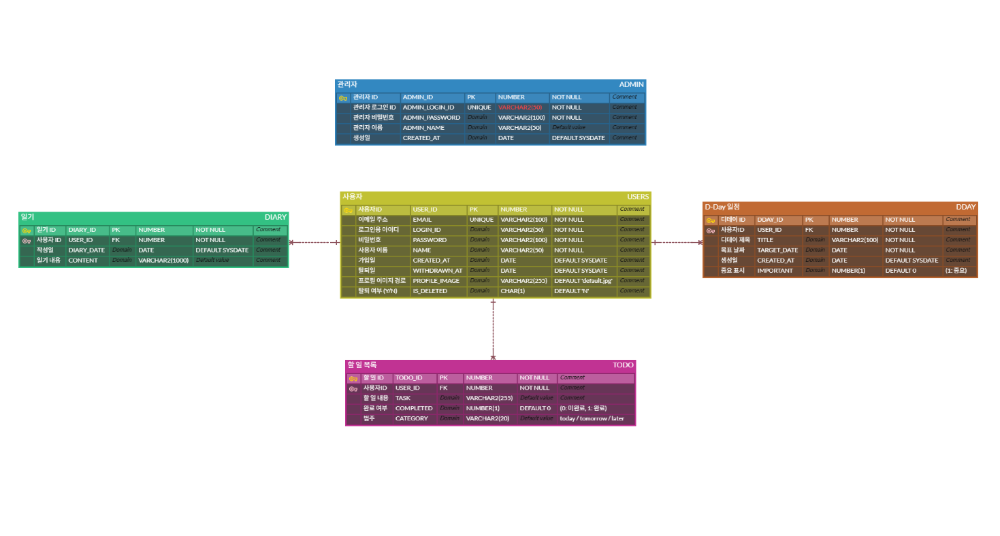

# 🎯 **OneDayLog**

> **“하루를 기록하고, 내일을 준비하는 가장 가벼운 습관”**  
> _OneDayLog는 일기, 할 일, D-Day 기능을 통해  
한 줄로 하루를 정리하고 작은 목표를 실천할 수 있도록 도와주는  
라이트한 기록용 웹 애플리케이션입니다._

---

## 🧭 **기획 배경**

바쁜 일상 속에서 하루를 정리하고 계획할 수 있는  
**간단하고 직관적인 기록 도구**가 필요했습니다.  
복잡한 일정 관리 시스템보다  
**하루 한 줄**, 또는 간단한 체크리스트로도 만족할 수 있는  
**라이트한 기록용 웹앱**을 만들고자 했습니다.  

> **핵심 목표**  
> → _자기 주도적인 기록 습관 형성_  
> → _가벼운 목표 관리 기능 구현_

---

## 💡 **해결 컨셉**

`OneDayLog`는 다음과 같은 기능을 통해 사용자의 니즈를 충족합니다:

- ✅ **할 일 분류**: 오늘 / 내일 / 나중에로 구분, 즉시 실행 가능한 태스크 구성  
- 📝 **일기 작성**: 날짜별 간단한 일기 작성으로 감정 및 행동 회고  
- 📅 **D-Day 관리**: 목표일 등록, 남은 날짜 자동 계산  
- 🧑‍💻 **회원 기능**: 내 정보 수정, 프로필 이미지 업로드 등 기본 관리 가능

---

## 🎯 **기대 효과**

- ✍️ **기록 습관 유도**: 꾸준한 일기/체크리스트 작성 습관 형성  
- 🎯 **단기 목표 시각화**: 할 일 & D-Day를 통해 작은 목표에 집중  
- 🎨 **사용자 친화적 UI/UX**:  
  - 다크모드  
  - 모달창  
  - 실시간 체크박스 인터랙션 등 적용  
- 🧠 **풀스택 학습**: 프론트부터 백엔드, DB까지 **직접 설계 및 구현**

---

## ⚙️ **기술 스택 & 라이브러리**

### 💻 Backend
- Java 8
- Spring MVC
- MyBatis
- Oracle DB

### 🌐 Frontend
- JSP / JSTL
- HTML5 / CSS3
- JavaScript (Vanilla)
- Bootstrap 5
- Flatpickr (날짜 선택)

### 🛠 Infra & Tools
- Apache Tomcat 9
- Git / GitHub
- ERDCloud (ERD 설계)
- Miro (와이어프레임 설계)
- Eclipse

---

## 📌 **구조 자료**

### 🗂 ERD  

### 🗂 DB 스키마  
📂 [DB 스키마 보기](./sql/onedaylog_database.sql)

### 🖼 와이어프레임 초안  
👉 [Miro 와이어프레임 보러가기](https://miro.com/app/board/uXjVIcFuTBg=/?share_link_id=615856206569)

### 🎥 시연 영상  
👉 [YouTube 시연 보기](https://youtu.be/EkuanXw5gbM)
